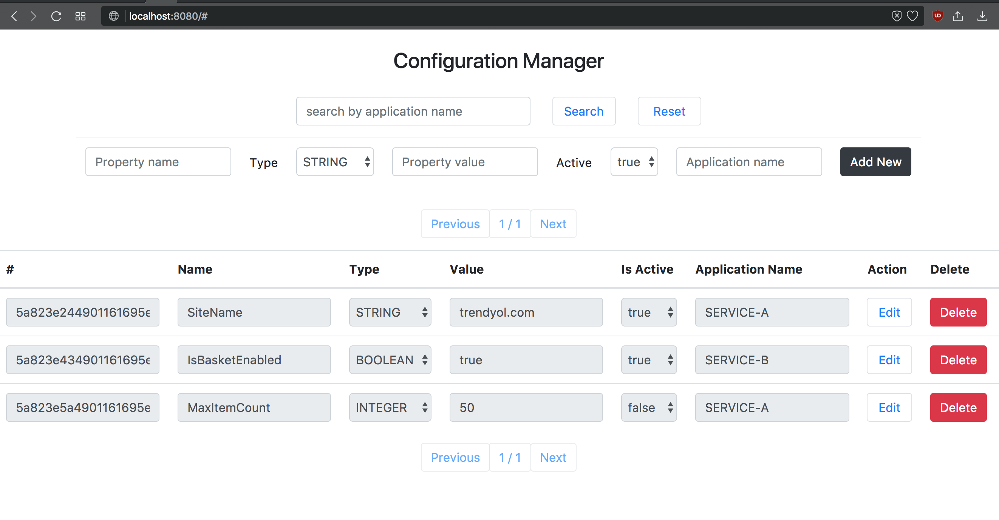

#### Configuration Manager UI

---

Konfigürasyon değerleri üzerinde silme, güncelleme ve ekleme işlemlerinin yapılmasını sağlayan uygulama arayüzüdür.



---

### 1. Kurulum

ℹ️ Sisteminizde `java 8` kurulu olduğundan emin olunuz, ve lütfen `maven` komutunun `java 1.8` ile çalıştığını doğrulayınız (`java 1.9` spring-boot'un son sürümde hataya yol açmaktadır):

```bash
➜  ./mvnw -version

Apache Maven 3.5.2 (138edd61fd100ec658bfa2d307c43b76940a5d7d; 2017-10-18T10:58:13+03:00)
Maven home: /Users/<user>/.m2/wrapper/dists/apache-maven-3.5.2-bin/28qa8v9e2mq69covern8vmdkj0/apache-maven-3.5.2
Java version: 1.8.0_152, vendor: Oracle Corporation
Java home: /Library/Java/JavaVirtualMachines/jdk1.8.0_152.jdk/Contents/Home/jre
Default locale: en_TR, platform encoding: UTF-8
OS name: "mac os x", version: "10.13.3", arch: "x86_64", family: "mac"
```

ℹ️ Derlenme aşamasında testlerden sonra otomatik olarak `docker` imajı oluşturulacağı için sisteminizde docker ve docker-compose komutlarının çalıştırılabilir ve `docker` daemon'ının ayakta olduğunu doğrulayınız:

```bash
➜  docker -v      
Docker version 17.09.0-ce, build afdb6d4
➜  docker-compose -v
docker-compose version 1.16.1, build 6d1ac21
```


Uygulama jar & docker imajlarının oluşturulması için aşağıdaki komutu çalıştırın:

```bash
➜  ./mvnw clean verify
```

---

#### 1.2. Uygulamanın Çalıştırılması

Java ile (java ile çalıştırırken ayrıca mongo db bağlantılarını gözden geçirmeniz gerekmektedır, varsayılanda "mongo" hostuna bağlanmaya çalışacaktır):

```bash
➜  java -jar target/configuration-manager-ui-0.1.0.jar --spring.profiles.active=test
```

Docker ile [aşağıdaki mongo sunucusunu da kurulumunu yapacaktır]:

```bash
➜  docker-compose -p configuration-manager-ui -f docker-compose.yml up -d 
```

Docker'daki aktif profilleri değiştirmek için `yml` dosyası içerisindeki `ACTIVE_PROFILES` değişkenini düzenleyebilirsiniz.

---

#### 1.2. Arayüze Erişim

Arayüze erişmek için:

http://localhost:8080

bağlantısı izlenerek arayüzün açılması sağlanır.

---

### 2. Uygulamanın dışarıya açtığı servisler

|# | Yol|  Tanım|
|---|---|----|
|GET |/api/configurations| Kayıtlı bütün ayarların listesini sunar |
|GET |/api/configurations/by-application-name| Bir uygulamaya ait konfigurasyon değerlerini döner. |
|POST |/api/configurations | Yeni bir kayıt oluşturulmasını sağlar|
|PUT |/api/configurations/{configurationId}| Bir kaydın güncellenmesini sağlar |
|DELETE |/api/configurations/{configurationId}| Bir kaydın silinmesini sağlar |

##### 2.1. Bütün Konfigürasyonların listesi

**Tanım**

DB'deki bütün kayıtların listesini döner.

**Metod imzası**

```bash
GET /api/configurations?pageNumber=#&pageSize=#
```

|Değişken | Tip |Anlamı|
|---|---|---|
| pageNumber | Integer| Çekilecek sayfa numarasını belirtir. Minimum değeri `0`dır|
| pageSize | Integer| Çekilecek sayfa boyutunu belirtir. Minimum değeri `1`, maksimum değeri `250` |


**Dönüş değeri**

Ayarların listesini içerir. Her bir ayar:

| Değişken |Tip | Anlamı|
|---|---|---|
| id | String| Kaydın tanımlayıcısıdır |
| name | String| Özelliğin ismidir|
| type | Enum| Konfigurasyonun tipini belirtir. `STRING`,`BOOLEAN`,`INTEGER`,`DOUBLE` değerlerinden birini alabilir.|
| value | *Herhangi bir değer*|Konfigurasyonun değerini belirtir |
| active | Boolean|Konfigurasyonun aktif olup olmadığını döner |
| applicationName | String|Hangi uygulamaya ait bir konfigurasyonun olduğunubelirtir |


##### 2.2. Bir Uygulamaya Ait Bütün Konfigürasyonların listesi

**Tanım**

DB'deki bütün kayıtların listesini döner.

**Metod imzası**

```bash
GET /api/configurations?applicationName=#&pageNumber=#&pageSize=#
```

|Değişken | Tip |Anlamı|
|---|---|---|
| applicationName | String| Detayı alınacak uygulamanın adını|
| pageNumber | Integer| Çekilecek sayfa numarasını belirtir. Minimum değeri `0`dır|
| pageSize | Integer| Çekilecek sayfa boyutunu belirtir. Minimum değeri `1`, maksimum değeri `250` |


**Dönüş değeri**

Ayarların listesini içerir. Her bir ayar:

| Değişken |Tip | Anlamı|
|---|---|---|
| id | String| Kaydın tanımlayıcısıdır |
| name | String| Özelliğin ismidir|
| type | Enum| Konfigurasyonun tipini belirtir. `STRING`,`BOOLEAN`,`INTEGER`,`DOUBLE` değerlerinden birini alabilir.|
| value | *Herhangi bir değer*|Konfigurasyonun değerini belirtir |
| active | Boolean|Konfigurasyonun aktif olup olmadığını döner |
| applicationName | String|Hangi uygulamaya ait bir konfigurasyonun olduğunubelirtir |


##### 2.1.3. Konfigürasyon Düzenleme

**Tanım**

Bir konfigürasyonun tanımlarında değişiklik yapılmasını sağlar.

**Method signature**

```bash
PUT /api/configurations/{configurationId}
{
	"name": #,
	"type": #,
	"value": #,
	"active": #,
	"applicationName": #,
}
```

| Değişken |Tip | Anlamı|
|---|---|---|
| configurationId | String| Kaydın tanımlayıcısıdır |
| name | String| Özelliğin ismidir|
| type | Enum| Konfigurasyonun tipini belirtir. `STRING`,`BOOLEAN`,`INTEGER`,`DOUBLE` değerlerinden birini alabilir.|
| value | *Herhangi bir değer*|Konfigurasyonun değerini belirtir |
| active | Boolean|Konfigurasyonun aktif olup olmadığını döner |
| applicationName | String|Hangi uygulamaya ait bir konfigurasyonun olduğunubelirtir |

**Response**

| Değişken |Tip | Anlamı|
|---|---|---|
| id | String| Kaydın tanımlayıcısıdır |
| name | String| Özelliğin ismidir|
| type | Enum | Konfigurasyonun tipini belirtir. `STRING`,`BOOLEAN`,`INTEGER`,`DOUBLE` değerlerinden birini alabilir.|
| value | *Herhangi bir değer*|Konfigurasyonun değerini belirtir |
| active | Boolean|Konfigurasyonun aktif olup olmadığını döner |
| applicationName | String|Hangi uygulamaya ait bir konfigurasyonun olduğunubelirtir |


##### 2.1.3. Konfigürasyon Düzenleme

**Tanım**

Yeni bir konfigürasyon tanımının kaydedilmesini sağlar.

**Method signature**

```bash
POST /api/configurations
{
	"name": #,
	"type": #,
	"value": #,
	"active": #,
	"applicationName": #,
}
```

| Değişken |Tip | Anlamı|
|---|---|---|
| name | String| Özelliğin ismidir|
| type | Enum| Konfigurasyonun tipini belirtir. `STRING`,`BOOLEAN`,`INTEGER`,`DOUBLE` değerlerinden birini alabilir.|
| value | *Herhangi bir değer*|Konfigurasyonun değerini belirtir |
| active | Boolean|Konfigurasyonun aktif olup olmadığını döner |
| applicationName | String|Hangi uygulamaya ait bir konfigurasyonun olduğunubelirtir |

**Response**

| Değişken |Tip | Anlamı|
|---|---|---|
| id | String| Kaydın tanımlayıcısıdır |
| name | String| Özelliğin ismidir|
| type | Enum | Konfigurasyonun tipini belirtir. `STRING`,`BOOLEAN`,`INTEGER`,`DOUBLE` değerlerinden birini alabilir.|
| value | *Herhangi bir değer*|Konfigurasyonun değerini belirtir |
| active | Boolean|Konfigurasyonun aktif olup olmadığını döner |
| applicationName | String|Hangi uygulamaya ait bir konfigurasyonun olduğunubelirtir |


##### 2.1.3. Konfigürasyon Silme

**Tanım**

Bir konfigürasyonun tanımının silinmesini sağlar.

**Method signature**

```bash
DELETE /api/configurations/{configurationId}
```

| Değişken |Tip | Anlamı|
|---|---|---|
| configurationId | String| Kaydın tanımlayıcısıdır |

**Response**

Http 200 döner.


